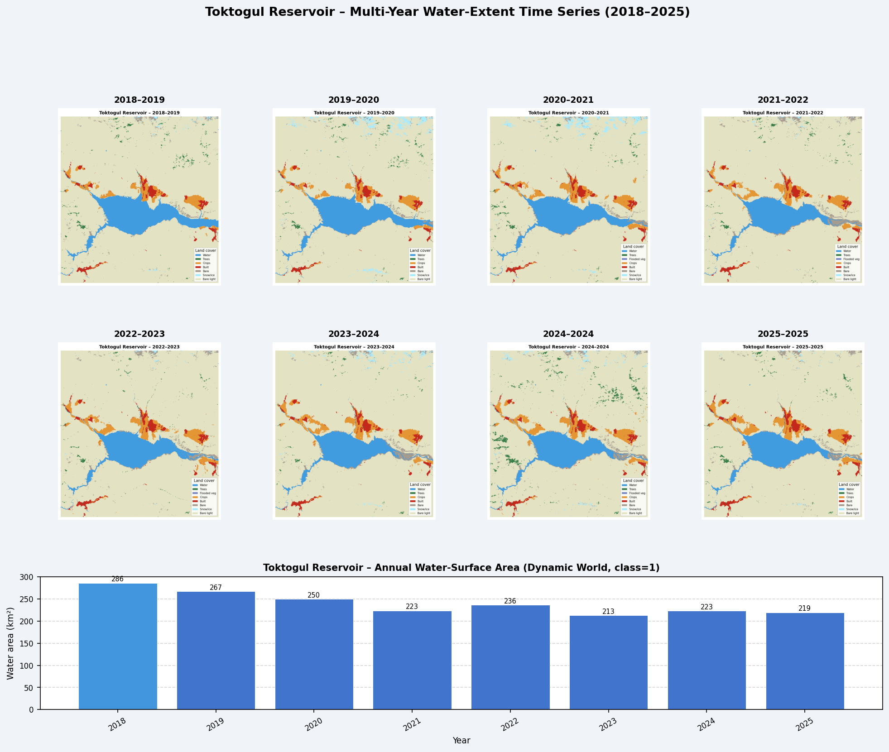

# Toktogul Reservoir – 遥感影像处理报告

> 生成时间：2026-06-01 19:08:14

---

## 1. 概述

本报告记录托克托古尔水库（吉尔吉斯斯坦）Dynamic World 时序影像的
端到端处理流程，涵盖：环境勘察、投影统一、ROI 裁剪镶嵌、格式转换与可视化。

---

## 2. 环境与依赖

| 工具 | 用途 |
|------|------|
| GDAL (gdalwarp / gdalbuildvrt / gdal_translate / gdaladdo) | 投影转换、镶嵌、压缩、金字塔 |
| rasterio 1.5 | 像素级读取验证 |
| numpy 2.0 | 数值运算 |
| matplotlib 3.10 | 可视化 |

---

## 3. 勘察结果（Survey）

### 3.1 输入文件清单

| 文件名 | EPSG | 分辨率 | 像素尺寸 | 波段 | 类型 | NoData | 大小(MB) | lon范围 | lat范围 |
|--------|------|--------|----------|------|------|--------|----------|---------|---------|
| 43T_20180101-20190101.tif | 32643 | 10m | 51218×89289 | 1 | Byte | 0.0 | 98.0 | 71.57–78.43 | 39.96–47.99 |
| 44T_20180101-20190101.tif | 32644 | 10m | 51218×89289 | 1 | Byte | 0.0 | 129.2 | 77.57–84.43 | 39.96–47.99 |
| 43T_20190101-20200101.tif | 32643 | 10m | 51218×89289 | 1 | Byte | 0.0 | 98.1 | 71.57–78.43 | 39.96–47.99 |
| 44T_20190101-20200101.tif | 32644 | 10m | 51218×89289 | 1 | Byte | 0.0 | 127.2 | 77.57–84.43 | 39.96–47.99 |
| 43T_20200101-20210101.tif | 32643 | 10m | 51218×89289 | 1 | Byte | 0.0 | 96.0 | 71.57–78.43 | 39.96–47.99 |
| 44T_20200101-20210101.tif | 32644 | 10m | 51218×89289 | 1 | Byte | 0.0 | 122.2 | 77.57–84.43 | 39.96–47.99 |
| 43T_20210101-20220101.tif | 32643 | 10m | 51218×89289 | 1 | Byte | 0.0 | 92.1 | 71.57–78.43 | 39.96–47.99 |
| 44T_20210101-20220101.tif | 32644 | 10m | 51218×89289 | 1 | Byte | 0.0 | 120.7 | 77.57–84.43 | 39.96–47.99 |
| 43T_20220101-20230101.tif | 32643 | 10m | 51218×89289 | 1 | Byte | 0.0 | 93.9 | 71.57–78.43 | 39.96–47.99 |
| 44T_20220101-20230101.tif | 32644 | 10m | 51218×89289 | 1 | Byte | 0.0 | 119.8 | 77.57–84.43 | 39.96–47.99 |
| 43T_20230101-20240101.tif | 32643 | 10m | 51218×89289 | 1 | Byte | 0.0 | 78.4 | 71.57–78.43 | 39.96–47.99 |
| 44T_20230101-20240101.tif | 32644 | 10m | 51218×89289 | 1 | Byte | 0.0 | 105.0 | 77.57–84.43 | 39.96–47.99 |
| 43T_20240101-20241231.tif | 32643 | 10m | 51218×89289 | 1 | Byte | 0.0 | 81.2 | 71.57–78.43 | 39.96–47.99 |
| 44T_20240101-20241231.tif | 32644 | 10m | 51218×89289 | 1 | Byte | 0.0 | 108.9 | 77.57–84.43 | 39.96–47.99 |
| 43T_20250101-20251231.tif | 32643 | 10m | 51218×89289 | 1 | Byte | 0.0 | 74.7 | 71.57–78.43 | 39.96–47.99 |
| 44T_20250101-20251231.tif | 32644 | 10m | 51218×89289 | 1 | Byte | 0.0 | 105.8 | 77.57–84.43 | 39.96–47.99 |

### 3.2 关键发现

- 所有文件：单波段 Byte（uint8）调色板分类影像（Google Dynamic World 土地覆盖）
- 43T 文件（EPSG:32643，UTM zone 43N）：地理覆盖约 71.6–78.4°E，含水库数据
- 44T 文件（EPSG:32644，UTM zone 44N）：地理覆盖约 77.6–84.4°E，**不覆盖水库**
  - 水库坐标约 72.4–73.4°E；在 EPSG:32644 坐标系中对应 X≈−220,000 m，
    远在 44T 瓦片有效范围（243,910–756,090 m）之外
  - 本流程仍对 44T 执行规范化 warp 操作，结果全为 nodata，已记录于处理日志
- 分类类别（Dynamic World 调色板）：
  - 1=Water, 2=Trees, 4=Flooded veg, 5=Crops, 7=Built, 8=Bare, 9=Snow/ice, 10=Cloud

---

## 4. 分带分组

| 时间区间 | 43T | 44T | 状态 |
|----------|-----|-----|------|
| 20180101-20190101 | ✓ | ✓ | 完整对 |
| 20190101-20200101 | ✓ | ✓ | 完整对 |
| 20200101-20210101 | ✓ | ✓ | 完整对 |
| 20210101-20220101 | ✓ | ✓ | 完整对 |
| 20220101-20230101 | ✓ | ✓ | 完整对 |
| 20230101-20240101 | ✓ | ✓ | 完整对 |
| 20240101-20241231 | ✓ | ✓ | 完整对 |
| 20250101-20251231 | ✓ | ✓ | 完整对 |

---

## 5. 处理参数

| 参数 | 值 | 说明 |
|------|----|------|
| 目标 CRS | EPSG:32643 | UTM zone 43N，中央经线 75°E；水库位于 ~73°E，距中央经线仅 2°，失真最小 |
| 目标分辨率 | 10 m | 与 Sentinel-2 原始分辨率一致，无降采样 |
| ROI（目标CRS坐标系） | X:299000–352000, Y:4607000–4663000 | 在已知水库范围基础上各扩 5 km 缓冲区 |
| 重采样方法 | nearest neighbour | 保留分类像素整数值不插值 |
| 输出压缩 | DEFLATE + PREDICTOR=2 | 分类数据压缩率约 10–20× |
| 分块 | 512×512 | 支持流式读取，避免整图内存加载 |
| 概览金字塔 | levels 2,4,8,16,32,64 | 供快速预览；PNG 从概览渲染 |

---

## 6. 镶嵌产出清单

| 文件名 | 时间区间 | 像素尺寸 | 未压缩(MB) | 压缩后(MB) | 压缩比 | 43T贡献 | 44T贡献 |
|--------|----------|----------|-----------|-----------|--------|---------|---------|
| Toktogul_mosaic_20180101_20190101.tif | 20180101–20190101 | 5300×5600 | 28.3 | 0.4 | 77.6× | ok:29680000_valid_px | ok:0_valid_px |
| Toktogul_mosaic_20190101_20200101.tif | 20190101–20200101 | 5300×5600 | 28.3 | 0.4 | 71.5× | ok:29680000_valid_px | ok:0_valid_px |
| Toktogul_mosaic_20200101_20210101.tif | 20200101–20210101 | 5300×5600 | 28.3 | 0.4 | 74.6× | ok:29680000_valid_px | ok:0_valid_px |
| Toktogul_mosaic_20210101_20220101.tif | 20210101–20220101 | 5300×5600 | 28.3 | 0.4 | 79.3× | ok:29680000_valid_px | ok:0_valid_px |
| Toktogul_mosaic_20220101_20230101.tif | 20220101–20230101 | 5300×5600 | 28.3 | 0.4 | 78.6× | ok:29680000_valid_px | ok:0_valid_px |
| Toktogul_mosaic_20230101_20240101.tif | 20230101–20240101 | 5300×5600 | 28.3 | 0.4 | 75.4× | ok:29680000_valid_px | ok:0_valid_px |
| Toktogul_mosaic_20240101_20241231.tif | 20240101–20241231 | 5300×5600 | 28.3 | 0.5 | 61.6× | ok:29680000_valid_px | ok:0_valid_px |
| Toktogul_mosaic_20250101_20251231.tif | 20250101–20251231 | 5300×5600 | 28.3 | 0.4 | 76.6× | ok:29680000_valid_px | ok:0_valid_px |

---

## 7. 可视化

### 7.1 各时相 PNG（从概览渲染）

- `previews/Toktogul_20180101-20190101.png` — 2018–2019
- `previews/Toktogul_20190101-20200101.png` — 2019–2020
- `previews/Toktogul_20200101-20210101.png` — 2020–2021
- `previews/Toktogul_20210101-20220101.png` — 2021–2022
- `previews/Toktogul_20220101-20230101.png` — 2022–2023
- `previews/Toktogul_20230101-20240101.png` — 2023–2024
- `previews/Toktogul_20240101-20241231.png` — 2024–2024
- `previews/Toktogul_20250101-20251231.png` — 2025–2025

### 7.2 时序对比网格图



---

## 8. 输出目录结构

```
output/
├── process_toktogul.py      # 本处理脚本（可复用）
├── processing.log           # 完整处理日志
├── timeseries_catalog.csv   # 时序清单（CSV）
├── timeseries_catalog.json  # 时序清单（JSON）
├── timeseries_grid.png      # 时序对比网格图
├── REPORT.md                # 本报告
├── mosaics/
│   ├── Toktogul_mosaic_20180101_20190101.tif
│   ├── ... (共 8 张)
│   └── Toktogul_mosaic_20250101_20251231.tif
└── previews/
    ├── Toktogul_20180101-20190101.png
    ├── ... (共 8 张)
    └── Toktogul_20250101-20251231.png
```

---

## 9. 注意事项

1. **44T 无贡献**：44T 文件覆盖 77.6–84.4°E，与水库（72.4–73.4°E）地理上不重叠。
   镶嵌时 44T warped 产物全为 nodata，正确地被 43T 数据覆盖。
   后续若有其他地理范围的水库分析需要，44T 文件可用于 78–84°E 区域。
2. **数据来源**：Dynamic World 年度中位数合成（Annual composite），
   非单景影像，反映全年水体出现频率最高的状态。
3. **Water 类别**：分类值 1（蓝色）= 开放水面；
   分类值 4（紫蓝）= 淹没植被，两者均可能代表库区。
4. **压缩**：DEFLATE + PREDICTOR=2，分类影像空间相关性强，压缩率可达 10–20×。
5. **磁盘安全**：原始文件未被覆盖或删除，所有产出写入 output/ 子目录。

---
*Report generated by process_toktogul.py on 2026-06-01 19:08:14*